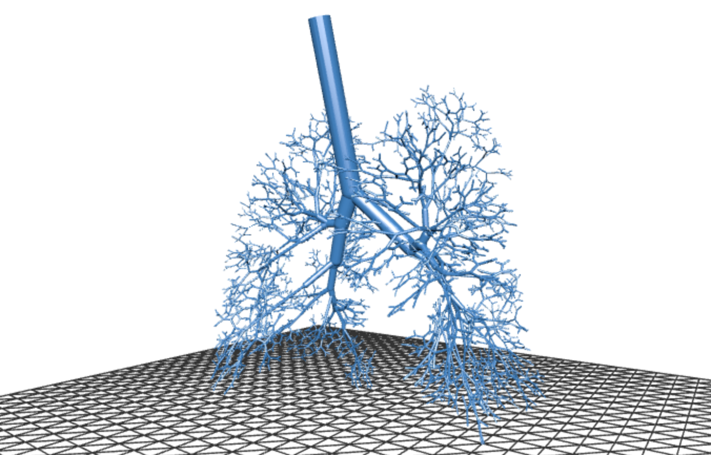
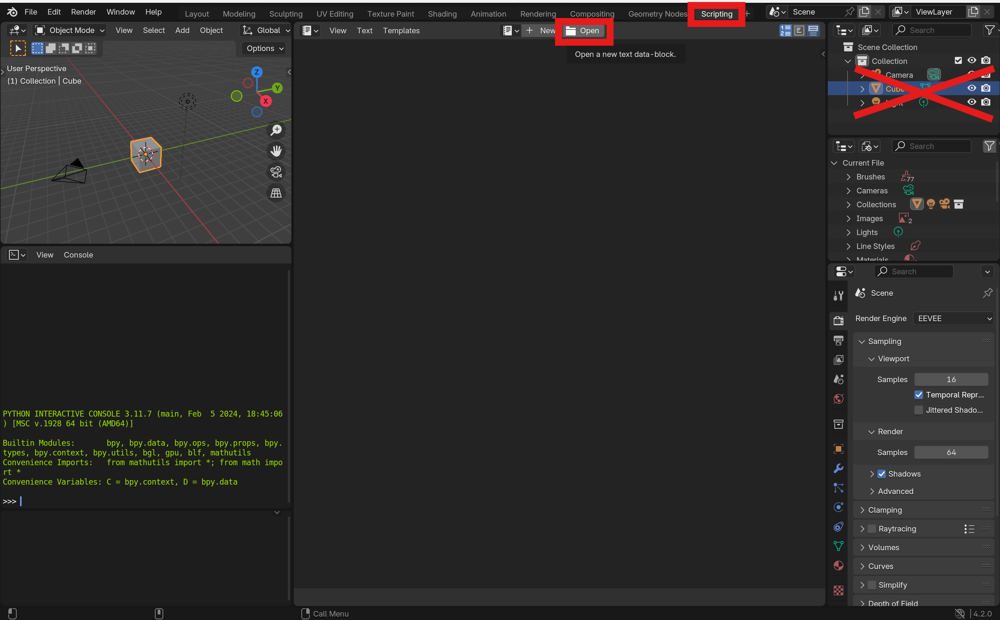
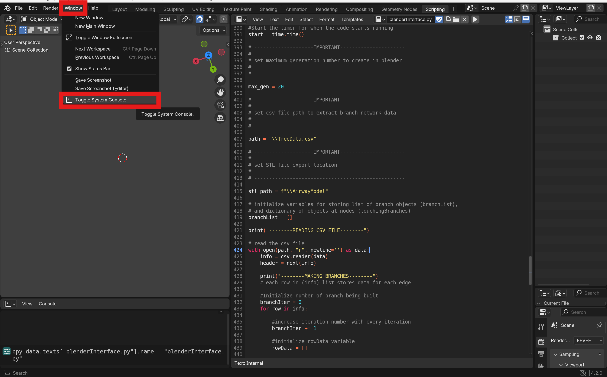
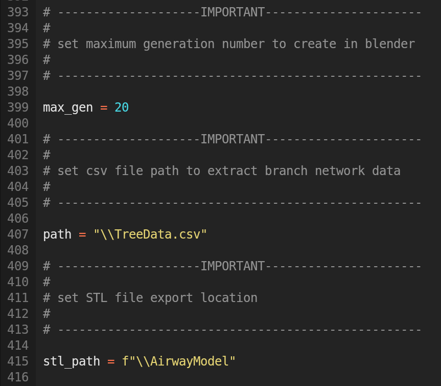
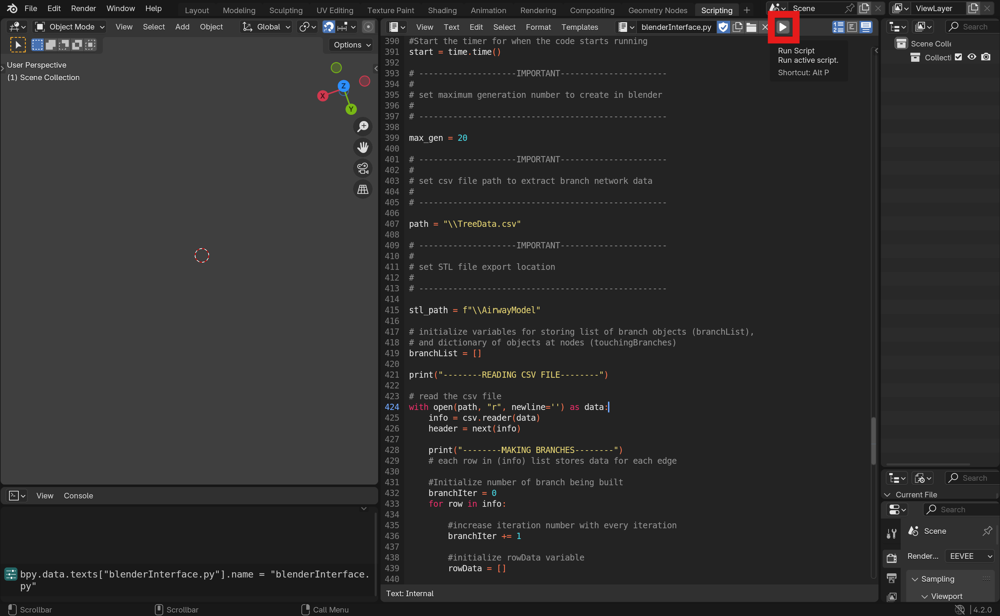
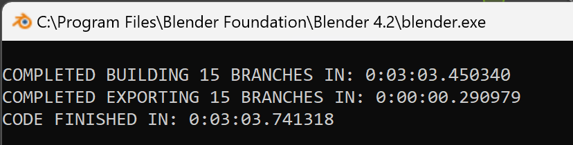
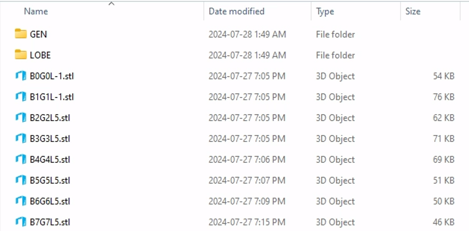
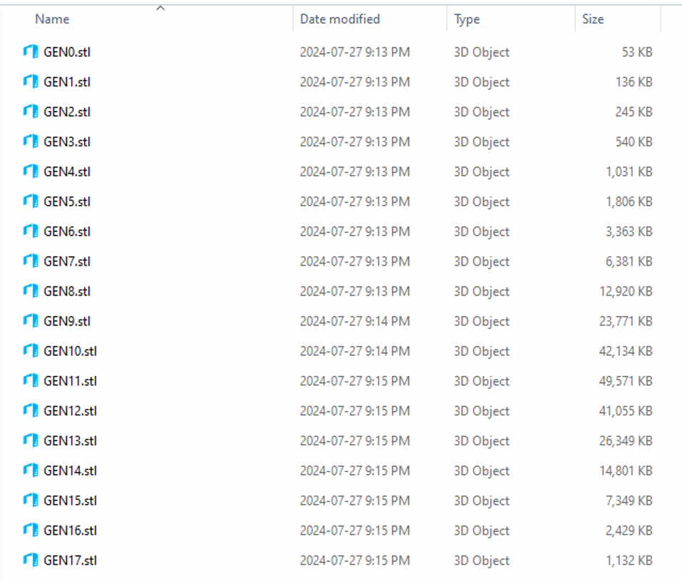
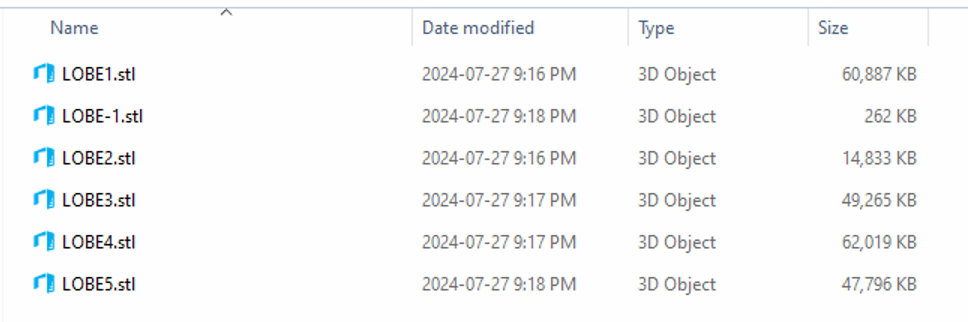

# BRANCH BUILDER

This repository contains the code for a Blender script that creates hollow branching network objects for use as geometries in CFD. It works by reading a CSV file of the branch data. Each branch is represented by a row in the CSV file. The model approximates branches as straight, hollow, cylinders with hollow spheres at each bifurcation point and the ends of terminal branches. The code was made to work with Blender 4.2, other versions may not be compatible.

## Demo Airway Model

  
  
Rendering of 17 Generation Model of the Human Bronchial Tree from Schmidt et al 2004 [1]

The above render was created from the generation stl files built by `blenderInterface.py` Using human airway topological graph data from Schmidt et al 2004 [1] (accessible here: https://simtk.org/projects/lungsim) we were able to extract data from the `Demo/Treefile.txt` into the CSV file `Demo/TreeData.csv` with the custom `Demo\TXTtoCSV.py` script. From there, the CSV file data could be imported into the `blenderInterface.py` file running on Blender's **scripting** tool to build the airway branching network.

  
  [</img>](https://github.com/Nick2858/Branch-Builder/blob/main/Demo/FullTreeDemo.stl)

View and interact with a decimated version of the complete Bronchial Tree in [Demo/FullTreeDemo.stl](Demo/FullTreeDemo.stl)

[1] Schmidt, A.; Zidowitz, S.; Kriete, A.; Denhard, T.; Krass, S.; Peitgen, H.-O. _A Digital Reference Model of the Human Bronchial Tree_. Comput. Med. Imaging Graph. 2004, 28, 203–211.

## Setup

### Step 1: Open Script in Blender
The first step in setting up this program to build a branch network is downloading the `blenderInterface.py` code. Once it's been downloaded, it can be opened in Blender. Go to **Scripting** and press **Open**. This will allow you to open the `blenderInterface.py` script in Blender. 

All default objects in the collection should be deleted before running the program. These objects are crossed out in the image below.

### Step 2: Toggle On System Console
The next step is to toggle on the System Console in Blender. This will allow you to monitor the program's progress, which will print information about what steps it's on while running. Blender does not respond when scripts are running, this is the only way to monitor whether the program is working.

### Step 3: Configure Settings
Before running the Python script, some settings must be adjusted. These settings can be found in the script and are displayed below. The `max_gen` variable holds an integer value of the maximum generation number the program will extract from the CSV file and build. The `path` variable holds a string value for the path to the CSV file containing the network data. The `stl_path` variable holds the string value for the path where you wish for the STL files to be exported.

### Step 4: Run Script
After configuring these settings, the program can be run in Blender. 

### Step 5: Check Completion
Once the program has finished running, a completion message will be printed in the console. An example is shown below:

The exported files will be accessible in the `stl_path` directory. The program creates a GEN and LOBE folder as well as a STL file for each branch with the name convention:

B(branch id)G(generation number)L(lobe number).stl

The GEN and LOBE folders contain STL files grouped by generation and lobe respectively. They will appear like this:

**GEN FOLDER**

**LOBE FOLDER**

